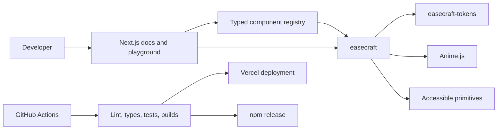

# Easecraft

> Accessible motion primitives and animated React components, powered by Anime.js.

**Document status:** Build proposal v0.1
**Date:** 2026-07-25
**Planned core package:** `easecraft`
**Working website:** `easecraft.dev`

> The source repository is confirmed at `Eswar2000/easecraft`. The unscoped package names below were unregistered on npm as of 2026-07-25; availability checks do not reserve names. Social handles, domain names, and trademark availability still require final verification.

## 1. Executive Summary

Easecraft is an open-source motion design system for React. It combines:

1. A small, stable package of motion primitives and accessible animated UI components.
2. A browsable registry of polished components that developers can copy into their applications.
3. An interactive playground for changing timing, easing, stagger, and direction while seeing the generated code.
4. Documentation that explains when motion helps, how each component behaves, and how reduced-motion users are supported.

Anime.js is the animation engine. Easecraft owns the React lifecycle integration, component APIs, motion tokens, accessibility behavior, examples, testing, and documentation.

The project should feel like a working developer tool, not an animation gallery. Its first screen should open directly into the component explorer and live preview experience.

## 2. Product Name And Identity

### Recommended Name

**Easecraft**

The name connects animation easing with deliberate craftsmanship. It is understandable to frontend developers without locking the project to Anime.js forever.

### Tagline

**Accessible motion primitives and animated React components, powered by Anime.js.**

### Package And Repository Names

| Surface | Confirmed or planned identifier |
| --- | --- |
| GitHub repository | `Eswar2000/easecraft` |
| Core package | `easecraft` |
| Token package | `easecraft-tokens` |
| Registry metadata package | `easecraft-registry` |
| Registry CLI, post-MVP | `easecraft-cli` |
| Documentation site | `easecraft.dev` |
| Initial preview URL | `easecraft-ui.vercel.app` |

### Backup Names

Use these only if Easecraft is unavailable:

- Tempoform
- Keyflow UI
- Motion Foundry
- Easeframe
- ChoreoKit

### Visual Direction

The interface should resemble a motion lab or timing sheet rather than a generic SaaS dashboard.

- **Primary surfaces:** clean white and near-black
- **Signal colors:** vermilion, electric cyan, and safety yellow
- **Background treatment:** a restrained timing-grid pattern, not decorative blobs or gradients
- **Display type:** Bricolage Grotesque
- **Body type:** Source Sans 3
- **Code type:** IBM Plex Mono
- **Shape language:** square or lightly rounded controls, maximum 8px card radius
- **Motion language:** crisp, interruptible, and purposeful; avoid animating every element

The brand should appear prominently in the first viewport, but the component explorer must remain the primary experience. A hint of the next component row should remain visible at common desktop and mobile viewport sizes.

## 3. Problem Statement

Frontend teams often add animations locally with inconsistent durations, easing curves, lifecycle handling, and accessibility behavior. Existing animation libraries provide powerful engines, but teams still need to solve:

- React mount and unmount cleanup
- Enter and exit coordination
- Animation interruption and replay
- Shared timing and easing rules
- Keyboard and screen-reader behavior
- `prefers-reduced-motion`
- Server-rendering compatibility
- Reusable component APIs
- Documentation and discoverability
- Performance and regression testing

Easecraft addresses this gap without attempting to replace Anime.js.

## 4. Product Thesis

Motion should communicate state, hierarchy, causality, and progress. A reusable motion system is valuable when it makes correct behavior easier than one-off animation code.

Easecraft will be differentiated by four qualities:

1. **Inspectability:** Every component has a live preview, controls, generated code, and documented motion decisions.
2. **Accessibility:** Reduced motion and semantic interaction are designed into the API.
3. **Composability:** Low-level primitives and high-level components use the same token system.
4. **Production readiness:** Components are typed, tested, tree-shakable, and safe under React lifecycle behavior.

## 5. Target Users

### Primary Users

- React developers who want polished motion without designing every timeline
- UI engineers building internal or public design systems
- Product designers who want to inspect and tune implementation-ready motion
- Portfolio builders who need accessible, reusable interaction patterns

### Secondary Users

- Educators demonstrating animation principles
- Open-source maintainers looking for copyable animated components
- Teams prototyping interaction behavior before integrating it into a larger system

## 6. Goals And Non-Goals

### Goals For Version 1

- Publish a typed React package built on Anime.js.
- Ship a focused set of production-quality motion primitives and components.
- Provide a live, responsive documentation and playground experience.
- Support system and application-level reduced-motion preferences.
- Demonstrate correct cleanup, interruption, focus management, and exit behavior.
- Publish automated, reproducible releases to npm.
- Provide an architecture and case study strong enough for a technical portfolio.

### Explicit Non-Goals For Version 1

- A general-purpose visual animation editor
- Arbitrary user-written JavaScript execution
- A replacement for Anime.js
- A complete static UI kit with forms, tables, and every common component
- Real-time multiplayer editing
- User accounts, teams, billing, or cloud projects
- Framework support beyond React
- A Figma plugin
- Video, GIF, or Lottie export

These exclusions keep the first release achievable and technically coherent.

## 7. Product Model

Easecraft has two public layers.

### Layer A: Stable Package

`easecraft` contains:

- Providers
- Hooks
- Motion primitives
- Accessible animated components
- TypeScript types
- Minimal structural styles where required

This layer prioritizes stable APIs, small imports, and predictable behavior.

### Layer B: Component Registry

The registry contains visually opinionated examples built from the stable package. Each registry item can be inspected and copied into an application.

This layer can evolve faster and may use Tailwind CSS for example styling. Consumers own copied source code.

Keeping these layers separate prevents flashy examples from destabilizing the core package.

## 8. Core User Journeys

### Journey 1: Discover And Install

1. A developer opens the site and immediately sees live component previews.
2. They filter by category, trigger, or motion purpose.
3. They open a component detail page.
4. They test mouse, keyboard, mobile, and reduced-motion behavior.
5. They choose package installation or copy-source usage.
6. They copy a working example and dependency command.

### Journey 2: Tune Motion

1. A developer opens a component in the playground.
2. They adjust duration, easing, delay, stagger, distance, and direction.
3. They play, pause, reverse, replay, or scrub the preview.
4. They toggle reduced motion.
5. The generated React code updates immediately.
6. They copy the generated code or share the configuration URL.

### Journey 3: Adopt System Tokens

1. A team defines its durations, easing curves, distances, and stagger values.
2. It passes those values to `MotionProvider`.
3. All Easecraft components inherit the same behavior.
4. Individual components can use approved overrides when needed.

### Journey 4: Validate Accessibility

1. A developer opens an example.
2. They enable reduced-motion simulation.
3. The preview changes to a non-spatial or instant alternative.
4. The documentation explains keyboard behavior, focus behavior, and semantic structure.

## 9. Information Architecture

### Required Routes

| Route | Purpose |
| --- | --- |
| `/` | Component explorer with filters and live previews |
| `/docs/getting-started` | Installation and first component |
| `/docs/concepts` | Tokens, presence, timelines, and reduced motion |
| `/components` | Full registry index |
| `/components/[slug]` | Preview, controls, code, API, and accessibility notes |
| `/playground` | Interactive motion configurator |
| `/tokens` | Token inspector and theme editor |
| `/accessibility` | Motion and interaction accessibility guidance |
| `/performance` | Performance model and benchmarks |
| `/changelog` | Package and registry changes |

### Component Detail Page

Each detail page must include:

- Live interactive preview
- Replay, pause, reverse, and reset controls where relevant
- Editable props
- Easing selector
- Duration, delay, distance, and stagger controls
- Viewport selector
- Normal and reduced-motion toggle
- Package and copy-source tabs
- Generated React code
- Dependency list
- API table
- Keyboard behavior
- Accessibility notes
- Performance notes
- Related components

Do not place the preview inside multiple nested cards. The preview should receive a stable, responsive stage with explicit dimensions so controls and dynamic content do not shift the page.

## 10. Version 1 Component Inventory

Version 1 should be deliberately limited. Nine excellent components are more valuable than forty shallow effects.

### Foundations

| Export | Responsibility |
| --- | --- |
| `MotionProvider` | Global tokens, reduced-motion mode, and defaults |
| `Motion` | Animate a single element through a controlled preset |
| `Presence` | Coordinate enter and exit without premature unmounting |
| `Stagger` | Coordinate child animation order and delay |
| `Timeline` | Compose named animation steps |

### Hooks

| Export | Responsibility |
| --- | --- |
| `useAnime` | Create a scoped Anime.js animation with cleanup |
| `useTimeline` | Control a scoped timeline from React |
| `usePresence` | Expose entering, present, and exiting states |
| `useReducedMotion` | Resolve system and provider preferences |
| `useScrollProgress` | Return normalized progress for a bounded target |

### Components

| Component | Primary behavior | Accessibility requirement |
| --- | --- | --- |
| `TextReveal` | Reveal by line, word, or character | Preserve readable DOM text and avoid repeated screen-reader output |
| `NumberTicker` | Animate between numeric values | Expose the final value and control live-region announcements |
| `StaggeredList` | Animate insertion, removal, and reordering | Preserve list semantics and focus stability |
| `AnimatedTabs` | Move an active indicator and transition panels | Use accessible tab semantics and keyboard navigation |
| `AnimatedAccordion` | Animate intrinsic-height disclosure panels | Preserve heading and region semantics, keyboard navigation, and focus during retained exits |
| `MotionDialog` | Animate overlay and content presence | Trap focus, restore focus, support Escape, and retain content during exit |
| `ToastStack` | Enter, dismiss, and reflow notifications | Use appropriate live-region behavior and pausable timeouts |
| `FilterGrid` | Animate filtering and layout changes | Keep controls keyboard accessible and avoid focus loss |
| `ScrollReveal` | Reveal content when it enters a bounded viewport | Content remains available without animation or JavaScript |

### Registry Examples

The registry should demonstrate the core through realistic compositions:

- Command palette
- Expandable project card
- Animated pricing comparison
- Notification center
- Filterable work gallery
- Onboarding progress sequence
- Mobile navigation panel
- Scroll-driven article timeline

These examples are copyable compositions, not additional stable package APIs.

## 11. Motion Token Model

Use semantic tokens instead of hard-coded values inside components.

```ts
export const defaultMotionTokens = {
  duration: {
    instant: 100,
    fast: 180,
    normal: 300,
    slow: 600,
  },
  distance: {
    small: 4,
    medium: 12,
    large: 24,
  },
  stagger: {
    tight: 25,
    normal: 60,
    relaxed: 100,
  },
  easing: {
    enter: "out(3)",
    exit: "in(2)",
    move: "inOut(3)",
    emphasized: "out(5)",
  },
} as const;
```

Token values are initial defaults, not universal truths. Validate them in the playground and adjust them based on usability testing.

### Token Principles

- Entering content may decelerate as it settles.
- Exiting content should generally complete faster than entering content.
- Repeated items should use bounded stagger so long lists do not become slow.
- Distance should scale with hierarchy, not viewport width.
- Text size must not scale directly with viewport width.
- Reduced motion should remove unnecessary spatial travel, not simply make every animation faster.

## 12. Proposed Public API

```tsx
import {
  MotionProvider,
  StaggeredList,
  TextReveal,
} from "easecraft";

const tokens = {
  duration: { normal: 360 },
  easing: { enter: "out(4)" },
};

export function App() {
  return (
    <MotionProvider tokens={tokens} reducedMotion="system">
      <TextReveal split="words" preset="rise">
        Motion should explain what changed.
      </TextReveal>

      <StaggeredList
        items={projects}
        getKey={(project) => project.id}
        preset="fade-rise"
      >
        {(project) => <ProjectCard project={project} />}
      </StaggeredList>
    </MotionProvider>
  );
}
```

### API Rules

- Prefer semantic presets such as `enter`, `exit`, `fade-rise`, and `reorder` over raw keyframes in high-level components.
- Keep low-level escape hatches available through primitives and hooks.
- Do not expose the internal Anime.js instance unless the component explicitly supports imperative control.
- Use controlled state for UI state and imperative handles only for animation playback controls.
- Every component must define its interruption behavior.
- Every component must document its reduced-motion behavior.
- Avoid boolean prop combinations that create invalid states.

## 13. Technical Architecture

### Recommended Stack

| Concern | Choice | Reason |
| --- | --- | --- |
| Language | TypeScript with strict mode | Public API safety and generated declarations |
| UI runtime | React, latest stable supported release | Primary target ecosystem |
| Animation engine | Anime.js, pinned stable release | Timeline, easing, stagger, and playback capabilities |
| Accessible primitives | Radix Primitives where applicable | Proven dialog, tabs, tooltip, and focus behavior |
| Monorepo | pnpm workspaces and Turborepo | Shared packages, examples, docs, and cached CI tasks |
| Package build | Vite library mode | ESM output, declarations, and familiar development workflow |
| Documentation | Next.js App Router | Static content, MDX, metadata, and Vercel integration |
| Documentation styling | CSS variables plus Tailwind CSS | Token-driven docs and productive registry examples |
| Content | MDX plus typed registry metadata | Rich documentation with validated structured data |
| Unit tests | Vitest | Fast TypeScript-oriented tests |
| Component tests | React Testing Library | User-oriented interaction tests |
| End-to-end tests | Playwright | Browser, viewport, keyboard, and reduced-motion coverage |
| Accessibility tests | axe-core integrated with Playwright | Automated baseline checks |
| Release management | Changesets | Versioning, changelogs, and coordinated package releases |
| CI/CD | GitHub Actions | Portable checks and npm publishing |

Pin exact versions when scaffolding. Use automated dependency updates only after the initial release pipeline is stable.

### System Diagram



### React And Anime.js Integration

The integration layer must:

- Scope selectors and animations to a component root.
- Create animation instances after the target DOM exists.
- Revert styles and release instances on unmount.
- Remain safe under React development lifecycle checks.
- Avoid recreating timelines for unrelated renders.
- Define behavior when props change during an active animation.
- Retain exiting content until its exit animation completes.
- Avoid reading and writing layout repeatedly in the same frame.
- Keep server output deterministic and start animation only on the client.

Use the official scoped cleanup API provided by the selected Anime.js version. Wrap that behavior once in `useAnime` rather than duplicating lifecycle code across components.

## 14. Repository Structure

```text
easecraft/
|-- apps/
|   `-- docs/
|       |-- app/
|       |-- components/
|       |-- content/
|       |-- lib/
|       `-- public/
|-- packages/
|   |-- react/
|   |   |-- src/
|   |   |   |-- components/
|   |   |   |-- hooks/
|   |   |   |-- primitives/
|   |   |   `-- index.ts
|   |   |-- package.json
|   |   `-- vite.config.ts
|   |-- tokens/
|   |   |-- src/
|   |   `-- package.json
|   |-- registry/
|   |   |-- items/
|   |   |-- schema/
|   |   `-- package.json
|   |-- eslint-config/
|   `-- typescript-config/
|-- examples/
|   `-- vite-react/
|-- tests/
|   `-- e2e/
|-- .changeset/
|-- .github/
|   `-- workflows/
|-- package.json
|-- pnpm-workspace.yaml
|-- turbo.json
`-- README.md
```

### Package Responsibilities

- `easecraft-tokens` must not depend on React or Anime.js.
- `easecraft` may depend on Anime.js and use React and Radix as declared dependencies or peers according to their integration model.
- `easecraft-registry` contains metadata and copyable source, not runtime application state.
- The docs app consumes published package entry points rather than reaching into package internals.
- The Vite example acts as a consumer smoke test.

## 15. Registry Data Model

Each component should have structured metadata validated at build time.

```ts
type RegistryItem = {
  name: string;
  slug: string;
  title: string;
  description: string;
  category: "text" | "layout" | "overlay" | "feedback" | "scroll";
  status: "experimental" | "stable" | "deprecated";
  packageExport?: string;
  dependencies: string[];
  files: Array<{
    path: string;
    type: "component" | "style" | "utility";
  }>;
  tags: string[];
  supportsReducedMotion: boolean;
  keyboardBehavior: string[];
};
```

Do not infer install commands from prose. Generate them from this metadata so documentation and registry dependencies remain synchronized.

## 16. Playground Design

### Version 1 Controls

- Component or preset selection
- Duration
- Delay
- Easing
- Distance
- Direction
- Stagger interval
- Stagger order
- Iteration count where appropriate
- Play, pause, reverse, replay, and reset
- Viewport size
- Reduced-motion mode
- Background contrast

### State And Sharing

Version 1 requires no database.

- Persist the latest local configuration in `localStorage`.
- Encode shareable configurations in a versioned URL query or hash.
- Validate and clamp all decoded values.
- Ignore unknown fields for forward compatibility.
- Do not execute arbitrary JSX or JavaScript from URL state.

### Code Generation

Generated code must come from typed templates and validated configuration. It should never use `eval`, `new Function`, or unsandboxed user code.

Generate:

- Package-based React usage
- Copy-source component usage
- Token override snippets
- Required installation command

The generated example must be formatted before display and covered by snapshot tests.

## 17. Accessibility Requirements

Accessibility is a release requirement, not a documentation-only feature.

### Reduced Motion

- Default to the operating-system preference.
- Support provider overrides: `system`, `always`, and `never`.
- Remove decorative spatial motion when reduction is requested.
- Preserve state communication through opacity, color, instant updates, or concise crossfades.
- Ensure essential loading and progress feedback remains understandable.
- Avoid autoplaying repeated motion when reduction is requested.

### Interaction

- Every action must be available without a pointer.
- Double-click must never be the only way to perform an action.
- Focus indicators must remain visible during and after animation.
- Closing overlays must restore focus to the triggering control.
- Content must not become focusable before it is meaningfully available.
- Toast timers must pause for hover and focus where dismissal timing matters.
- Text animation must preserve a coherent accessible name.

### Visual Safety

- Avoid flashing patterns.
- Avoid large, unexpected parallax movement.
- Never animate in a way that prevents reading or interaction.
- Do not use motion to conceal required information.

## 18. Performance Requirements

### Implementation Rules

- Prefer `transform` and `opacity` for frequent animation.
- Batch layout reads before writes.
- Do not animate unbounded off-screen collections.
- Cap staggered sequences so list length does not produce excessive waits.
- Use per-component package exports for tree shaking.
- Lazy-load documentation demos that are below the viewport.
- Pause continuous demonstrations when their page or preview is not visible.
- Avoid hydration-dependent layout shifts.

### Initial Budgets

Treat these as engineering budgets to validate, not marketing claims.

| Metric | Initial target |
| --- | --- |
| Core package JavaScript | Under 15 kB gzip, excluding React and Anime.js |
| Individual high-level component | Under 5 kB gzip where practical |
| Docs Lighthouse accessibility | 95 or higher on representative routes |
| Docs cumulative layout shift | Under 0.1 on representative routes |
| Long tasks during a basic component demo | None over 50 ms on reference hardware |
| Unsupported automated accessibility violations | Zero serious or critical findings |

Record the test device, browser, build mode, and scenario beside every benchmark.

## 19. Testing Strategy

### Unit Tests

Cover:

- Token resolution and partial overrides
- Reduced-motion preference resolution
- Preset normalization
- Timeline state transitions
- URL configuration encoding and decoding
- Code generation
- Registry schema validation

### Component Tests

Cover:

- Animation setup and cleanup
- Enter and exit completion callbacks
- Rapid state interruption
- Repeated mount and unmount
- Prop changes during playback
- Focus restoration
- Keyboard interactions
- Screen-reader-oriented DOM output
- Reduced-motion fallback behavior

Avoid tests that only assert Anime.js internals. Assert observable component behavior and the integration contract.

### End-To-End Tests

Run Playwright against Chromium, Firefox, and WebKit for critical journeys:

- Browse and filter components
- Open a detail page and operate the preview
- Change playground controls and copy generated code
- Reload and restore local playground state
- Open a shared configuration URL
- Navigate dialogs and tabs by keyboard
- Emulate reduced motion
- Validate desktop and mobile layouts
- Confirm component previews are nonblank and correctly framed

### Visual Tests

Capture stable checkpoints, not arbitrary animation frames.

- Initial state
- Enter-complete state
- Exit-complete state
- Reduced-motion state
- Mobile and desktop compositions

Expose a deterministic test mode that disables random values and seeks timelines to named checkpoints.

### Consumer Smoke Test

The `examples/vite-react` application must install the built package exactly as a consumer would. CI should build this example to detect missing exports, types, styles, or dependencies.

## 20. Hosting And Distribution Strategy

### Recommended Topology

| Asset | Platform | Strategy |
| --- | --- | --- |
| Source repository | GitHub | Public monorepo with issues and discussions |
| Documentation and playground | Vercel | Next.js deployment with PR previews |
| Runtime packages | npm | Public scoped packages with provenance |
| Static package delivery | npm CDN ecosystem | Allow standard services such as jsDelivr to mirror npm assets |
| Domain and DNS | Cloudflare Registrar and DNS, or equivalent | Redirect apex to `www` or choose one canonical hostname |
| Error reporting | Sentry, optional for v1 | Client errors with source maps and no sensitive data |
| Product analytics | Plausible or Vercel Web Analytics | Minimal, privacy-conscious event tracking |

### Why Vercel For The Site

- First-class Next.js support
- Automatic preview deployments for pull requests
- Simple custom-domain and TLS setup
- Edge caching for static documentation
- Straightforward environment management

The core library must remain platform-independent. Vercel should host the documentation, not become a runtime requirement for consumers.

### Database Strategy

Do not add a database for version 1. Local state and versioned share URLs cover the initial playground requirements.

If authenticated saved projects become a validated need, add a managed PostgreSQL service such as Supabase or Neon in a later release. Keep public share payloads versioned so existing links continue to work.

### npm Publishing

- Use Changesets for version selection and changelog generation.
- Use npm trusted publishing or OIDC provenance through GitHub Actions where supported.
- Require passing tests, package build, and consumer smoke build before release.
- Publish from CI, not a developer laptop.
- Use semantic versioning.
- Mark experimental exports clearly and avoid including them in the stable root entry point.

### Domain Launch Sequence

1. Launch on the Vercel preview domain.
2. Verify redirects, metadata, social cards, canonical URLs, and sitemap.
3. Connect the custom domain after name and trademark checks.
4. Configure DNS security and renewal notifications.
5. Keep the preview domain redirected to the canonical domain.

## 21. CI/CD Pipeline

### Pull Request Pipeline

Run these jobs:

1. Dependency lockfile validation
2. Formatting check
3. ESLint
4. TypeScript type checking
5. Unit and component tests
6. Package build
7. Consumer example build
8. Docs build
9. Playwright critical-path tests
10. Accessibility scan
11. Bundle-size comparison
12. Vercel preview deployment

Independent jobs should run in parallel after dependency installation and caching.

### Main Branch Pipeline

- Repeat required quality checks.
- Deploy production documentation after checks pass.
- Create or update a Changesets release pull request.
- Publish packages only after the release pull request is merged.
- Attach generated changelog and package links to the GitHub release.

### Branch Protection

- Require pull requests for `main`.
- Require successful checks.
- Block force pushes.
- Require at least one review once collaborators are involved.
- Enable dependency and secret scanning.

## 22. Security And Privacy

- Never evaluate arbitrary code in the playground.
- Sanitize MDX and registry content sources.
- Validate all URL-encoded playground configuration.
- Add a Content Security Policy suitable for the docs site.
- Do not expose source maps containing secrets.
- Keep analytics free of typed code, clipboard contents, and personal data.
- Use automated dependency scanning and lockfile review.
- Treat clipboard access as a user-triggered action and report failure clearly.
- If embeddable third-party examples are added later, run them in a sandboxed iframe on a separate origin.

## 23. Documentation Plan

### Getting Started

- Installation
- Peer dependencies
- Provider setup
- First component
- Styling model
- Framework and browser support

### Concepts

- Motion tokens
- Presence and exit animations
- Timeline orchestration
- Interruption behavior
- Reduced motion
- Performance
- Server rendering

### Per-Component Documentation

- Purpose and appropriate use
- Live example
- Installation or copy command
- API reference
- State model
- Keyboard interactions
- Reduced-motion behavior
- Performance characteristics
- Common mistakes

### Maintenance Documentation

- Contributing guide
- Component acceptance checklist
- Release process
- Architecture decision records
- Security policy
- Code of conduct

## 24. Delivery Plan

### Phase 0: Product And Repository Foundation

**Deliverables**

- Confirm project name and public identifiers.
- Create the pnpm/Turborepo workspace.
- Configure TypeScript, ESLint, formatting, and package builds.
- Create the docs shell and Vite consumer example.
- Configure GitHub Actions and Vercel previews.
- Write architecture decision records for package boundaries and styling.

**Exit criteria**

- A pull request runs lint, type check, tests, package build, example build, and docs build.
- The docs shell has a working preview deployment.
- A local package export can be consumed by the example application.

### Phase 1: Motion Foundation

**Deliverables**

- `easecraft-tokens`
- `MotionProvider`
- `useReducedMotion`
- `useAnime`
- `Motion`
- `Presence`
- `Stagger`
- Initial unit and lifecycle tests

**Exit criteria**

- Animations are scoped and cleaned up on unmount.
- Enter and exit behavior survives rapid toggling.
- Reduced-motion behavior is covered by tests.
- The package is tree-shakable and emits declarations.

### Phase 2: First Components

**Deliverables**

- `TextReveal`
- `NumberTicker`
- `StaggeredList`
- `AnimatedTabs`
- Documentation pages for each component

**Exit criteria**

- Each component has API, interaction, accessibility, and reduced-motion documentation.
- Keyboard and lifecycle tests pass.
- Examples work in the external Vite consumer application.

### Phase 3: Interactive Components

**Deliverables**

- `MotionDialog`
- `ToastStack`
- `FilterGrid`
- `ScrollReveal`
- `AnimatedAccordion`
- Registry compositions using the stable components

**Exit criteria**

- Focus and keyboard behavior pass automated and manual checks.
- Exit animations never remove content prematurely.
- Mobile layouts do not overlap or shift unexpectedly.

### Phase 4: Playground And Registry

**Deliverables**

- Typed component registry
- Motion controls
- Playback controls
- Reduced-motion simulation
- Generated code
- Local persistence
- Versioned share URLs

**Exit criteria**

- Shared configurations reproduce the same validated state.
- Generated examples compile in a fixture application.
- No arbitrary code execution path exists.
- Controls remain usable on mobile and by keyboard.

### Phase 5: Public Release

**Deliverables**

- Complete documentation
- Accessibility and performance reports
- Changesets release workflow
- npm provenance
- Custom domain
- README, contributing guide, and security policy
- Short demonstration video and technical case study

**Exit criteria**

- All release checks pass from a clean clone.
- The package installs and builds in a fresh React application.
- Critical Playwright tests pass across supported browsers.
- npm, documentation, changelog, and GitHub release versions agree.

## 25. Version 1 Definition Of Done

Version 1 is complete when:

- Nine planned components are documented and usable.
- Stable exports have typed public APIs.
- Every component defines interruption and reduced-motion behavior.
- The docs site works at mobile and desktop widths.
- The playground creates valid, shareable configurations.
- Package, copy-source, and generated-code paths are tested.
- Critical keyboard journeys work without a pointer.
- Automated checks report no serious or critical accessibility violations.
- Package cleanup is safe across repeated mounts and unmounts.
- A fresh consumer application can install and build the package.
- Releases are produced through CI with changelogs and provenance.
- The repository includes architecture, contribution, and maintenance documentation.

## 26. Risk Register

| Risk | Impact | Mitigation |
| --- | --- | --- |
| React lifecycle creates duplicate or stale animations | Broken state and memory leaks | Centralize scoped setup and cleanup in tested hooks |
| Exit animations conflict with unmounting | Content disappears too early | Use an explicit presence state machine |
| Accessibility becomes secondary to visual effects | Unusable components and weak credibility | Build on accessible primitives and require per-component checks |
| Registry scope grows too quickly | Delayed release and shallow quality | Freeze v1 at nine components and eight compositions |
| Package API mirrors Anime.js too closely | Weak abstraction and lock-in | Use semantic component APIs with low-level escape hatches |
| Documentation and package drift | Incorrect examples | Generate install data and API references from typed metadata |
| Playground introduces code execution risk | Security vulnerability | Generate from validated templates; never evaluate user code |
| Bundle size grows unnoticed | Poor adoption and performance | Per-export builds and automated size budgets |
| SSR or hydration behavior fails | Framework incompatibility | Keep server output deterministic and add Next.js smoke coverage |
| Name conflicts appear near launch | Rebranding cost | Verify package, domain, social, and trademark availability in Phase 0 |

## 27. Success Measures

### Technical Measures

- CI success rate and duration
- Bundle sizes by export
- Number of lifecycle regression tests
- Accessibility findings by severity
- Documentation route performance
- Supported-browser E2E pass rate

### Product Measures

- Component detail views
- Copy-source actions
- Package install-command copies
- Playground configuration shares
- Repeat documentation visits
- GitHub issues that lead to API or accessibility improvements

Stars and npm downloads can be reported, but they should not replace quality or usage evidence.

## 28. Portfolio And Resume Strategy

The public case study should explain:

1. Why an animation engine alone is not a motion design system.
2. How Easecraft coordinates React presence and Anime.js cleanup.
3. How motion tokens create consistency.
4. How reduced-motion behavior changes each interaction.
5. How the registry, package, docs, and deployment pipeline fit together.
6. What performance and accessibility tests found.
7. Which tradeoffs were made to keep version 1 focused.

### Suggested Resume Bullet

> Built and published Easecraft, an accessible React motion design system powered by Anime.js, with typed primitives, nine production-ready components, reduced-motion support, an interactive code-generating playground, cross-browser tests, and automated npm releases.

Use measured outcomes in the final resume bullet once real data exists. Do not invent adoption or performance figures.

## 29. Initial Issue Backlog

Create these as the first implementation issues:

1. Confirm the remaining public identifiers: domain, social handles, and trademark availability.
2. Scaffold pnpm workspaces and Turborepo.
3. Configure shared strict TypeScript settings.
4. Configure linting, formatting, and package scripts.
5. Scaffold `apps/docs` and `examples/vite-react`.
6. Create `easecraft-tokens` and its tests.
7. Design the `MotionProvider` contract.
8. Implement scoped `useAnime` setup and cleanup.
9. Implement reduced-motion preference resolution.
10. Implement and test `Motion`.
11. Implement the `Presence` state machine.
12. Build the component documentation template.
13. Implement `TextReveal` as the first vertical slice.
14. Add Playwright and axe checks for the first vertical slice.
15. Configure Changesets and a dry-run package release.

Issue 13 is the first complete product slice: package API, animation lifecycle, accessibility, documentation, testing, and consumer usage should all be proven before adding the remaining components.

## 30. Local Development Contract

The final repository should expose predictable root commands:

```bash
corepack enable
pnpm install
pnpm dev
pnpm lint
pnpm typecheck
pnpm test
pnpm test:e2e
pnpm build
pnpm changeset
```

`pnpm dev` should start the docs application and watch package builds through Turborepo. Document the actual local URL emitted by the development server rather than assuming a fixed port.

### Expected Environment Variables

Version 1 should require no secrets for local component development.

```dotenv
NEXT_PUBLIC_SITE_URL=http://localhost:3000
```

Production-only analytics or error-reporting variables must remain optional. The docs build should succeed when they are absent.

## 31. Build Decision Summary

The recommended first implementation is:

- **Name:** Easecraft
- **Product:** React motion package plus copyable registry and playground
- **Engine:** Anime.js
- **Accessibility base:** Radix Primitives where appropriate
- **Workspace:** pnpm and Turborepo
- **Package build:** Vite library mode
- **Docs:** Next.js and MDX
- **Hosting:** Vercel
- **Distribution:** npm with CI provenance
- **Source:** GitHub
- **Database:** None for version 1
- **Testing:** Vitest, Testing Library, Playwright, and axe-core
- **Release management:** Changesets
- **MVP:** Five foundations, five hooks, nine components, and eight registry compositions

The key implementation principle is to complete one vertical slice before broadening the catalog. `TextReveal` should prove the package API, Anime.js lifecycle, reduced-motion handling, documentation format, tests, code generation, and consumer build. Once that slice is credible, the remaining components can follow the same contract.